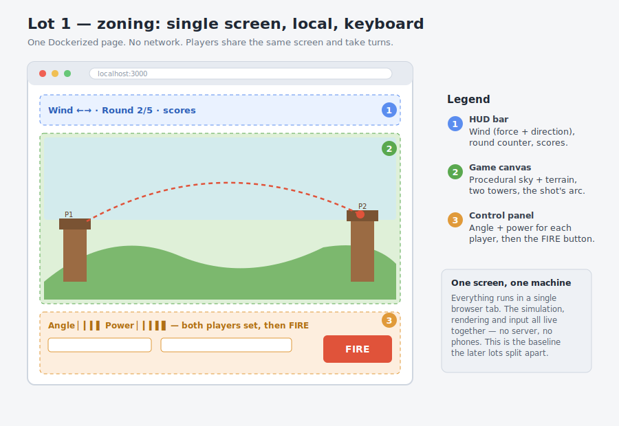
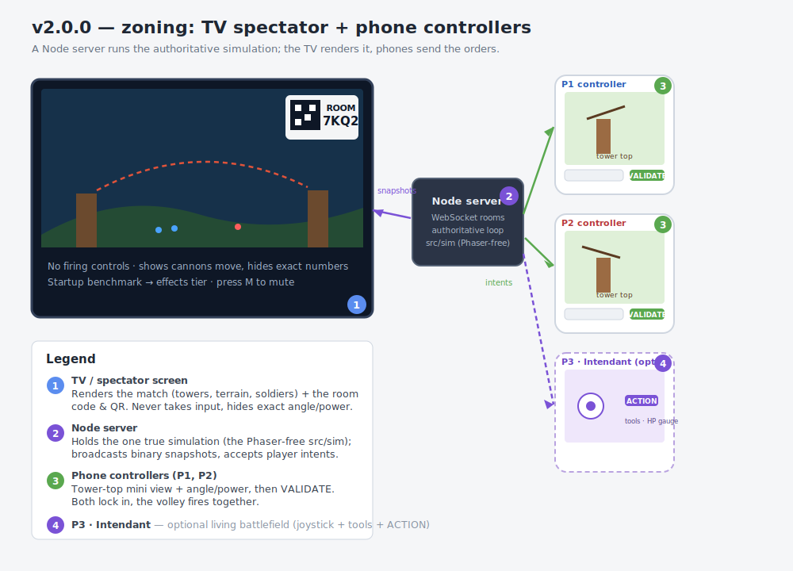

# Tower Duel

[](https://github.com/1e1/tower-phaser/releases)
[](https://github.com/1e1/tower-phaser/commits/main)
[](https://github.com/1e1/tower-phaser/blob/main/LICENSE)

> **A game built as a pretext for learning.** Tower Duel is first and foremost
> a teaching support: a complete, real video game whose code is the running
> example for an illustrated course on **how a web game is actually built** —
> from a single-file canvas duel to a networked, multi-screen, simulation-driven
> application. The game is fun to play, but the point is the journey that
> produced it. **▶ Read the course:** https://1e1.github.io/tower-phaser

A two-player artillery duel built with [Phaser](https://phaser.io/) 4 and bundled
with [Vite](https://vitejs.dev/). Two towers face each other across a procedural
landscape; each player sets the angle and power of a cannon. The twist on the
classic formula: **both players aim at the same time**, lock in their orders, and
the two shots fire together.

Since lot 3 the match is **connected**: one screen acts as the TV/spectator and
up to two phones or tablets act as the player controllers, coordinated by a Node
server that runs the authoritative simulation. As of v2.0.0 a neutral **third
player, the Intendant**, can turn the duel into a **living battlefield**.

**▶ Play online:** https://1e1.alwaysdata.net

## A learning project first

Every feature in this repository was added to illustrate a concrete idea in game
and web programming — it doubles as the worked example for the companion course
(see [Tutorial](#tutorial)). Reading the code alongside the chapters is the
intended way to use the project:

- **A game loop and physics** — angle/power, gravity, wind, collisions.
- **Procedural generation** — seeded terrain so a match is reproducible.
- **Rendering and theming** — parallax scenery, particles, runtime-synthesized
  audio (no binary assets), graceful degradation on slow hardware.
- **Real-time networking** — an authoritative server, WebSocket rooms, binary
  snapshots, interpolation, reconnection grace.
- **Architecture** — a Phaser-free simulation (`src/sim/`) shared by server and
  client, so the same code runs headless in tests and on screen in the browser.
- **Algorithms** — A* pathfinding for the living-battlefield soldiers, fast-math
  optimizations (squared-distance comparisons).

The course walks all of this in five illustrated chapters (one per biome), each
in three depth levels — **Discovery / Intermediate / Expert** — plus architecture
annexes, in five languages.

## Layout at a glance (zoning)

The course's through-line is how one shared screen grows into a networked,
multi-screen application. The two zoning mockups below frame that journey.

**Lot 1** — a single Dockerized page: simulation, rendering and input all in one
browser tab, players taking turns on the same keyboard.



**v2.0.0** — the same game split across devices: a Node server holds the one true
simulation, the TV renders it, and phones send the orders (plus an optional third
phone for the Intendant).



## Gameplay

- Pick player names, a round count and a biome on the setup screen.
- Each turn, the wind (strength and direction) changes and is shown at the top.
- Both players adjust their cannon simultaneously, then validate their shot.
- Once both shots are locked, the volley fires at once.
- A round is won by the first player to hit the opposing tower; the landscape is
  regenerated between rounds.
- A match is **first to N rounds**; the player who wins the most rounds wins.
- Whoever loses a round earns a **deployable shield**: instead of firing, you can
  place a one-shot defensive plate (angle sets its direction, power its distance)
  that absorbs a single incoming shell, then shatters. Shields stack across
  rounds.

## Connected play (TV + controllers)

1. Open the app on the shared screen and choose **Host on this screen (TV)**.
   Open it on the host's LAN address (e.g. `http://192.168.1.20:3000`) rather
   than `localhost` so phones on the same network can reach it. The QR code
   already points at the LAN address.
2. The TV shows a 4-character room code and a QR code. It never needs input.
3. Players open the app on their phone/tablet (scan the QR or enter the code),
   type a name and join. The first player to join picks the biome, the round
   count, the game mode and whether to enable the **living battlefield**.
4. Each player claims a side by tapping a tower, with a mutual ready gate.
5. Each player sets angle and power on their device — their tower top animates
   live (cannon orientation, charge tint, windsock) — then validates. When both
   have validated, the volley fires. The TV renders the match; it shows the
   cannons moving but never the exact numbers, and has no firing controls.
6. At the end, each player chooses **Play again** or **Disconnect**. When both
   choose to play again the match restarts; the **loser picks the next setup**.

A locked or slept phone keeps its seat for 10 s and auto-reconnects. Pressing
Escape returns to the home screen (the host tears the room down, a phone just
disconnects).

The chooser also picks a **game mode**. *Classic* is strict turn-by-turn
volleys. *Turbo* adds a shot clock — once one player validates, the other has a
few seconds to commit, and shells fly continuously so the next shot can be aimed
the instant the previous one leaves the barrel. In turbo the **wind is
continuous too**: instead of snapping to a new value each turn, it eases between
fresh keypoints every 10 s, with a lighter gust wave on top — each match rolls
its own "gustiness", from a steady breeze to squally rafales.

The terrain is **destructible**: every shell carves a crater out of the
landscape (relief and surface decor alike), so holes, caverns and overhangs
build up over the round — Worms-style. The terrain resets each round.

Extra people who join beyond the two slots wait in an ordered queue and
spectate the match (like the TV); when a slot frees up, the next in line takes
it over — even mid-match.

The TV runs a short startup benchmark and drops to a lighter effects tier on
slow hardware. Press `M` on the TV to toggle sound.

The authoritative simulation lives in `src/sim/` (Phaser-free) and runs on the
server; clients only render the snapshots it broadcasts.

## Living battlefield — the Intendant (v2.0.0)

When the host enables it, a neutral **third player, the Intendant**, joins from a
third device and the duel becomes a living world layered on top of the unchanged
2-player game. Gunpowder soldiers — musketeers, grenadiers, field cannons —
march continuously from one tower to the other, fight, and cross the terrain via
a real **A\* pathfinder** over the destructible surfaces. The Intendant
reterraforms the arena, builds structures, and wields a **magic shield** that
auto-intercepts incoming artillery (styled per biome: an ember vortex on Volcano,
heraldic aegis elsewhere). Scoring becomes a 3-way ranking — the two duelists'
victory points versus the Intendant's soldier crossings.

The whole layer is opt-in and gated behind a single flag: with the living
battlefield off, the 2-player frame and simulation are byte-for-byte unchanged.
The design notes live in [`design/`](design/).

## Biomes

Five selectable biomes, each with its own sky, palette, parallax scenery and
ambient particles: **Meadow**, **Desert**, **Tundra**, **Volcano** and
**Storm** (a stormy night with parallax lightning, wind-leaning rain and delayed
thunder). Sound effects (cannon fire, explosions, impacts, menu tones) and the
per-biome soundtracks are synthesized at runtime with the Web Audio API, so the
project ships **no binary audio assets**.

## Run locally (Node)

```bash
npm install
npm run build       # production bundle in dist/
npm start           # Node server (SPA + realtime) on http://localhost:3000
```

For development with hot reload, run the client and the realtime server side by
side (the Vite dev server proxies `/ws` to the Node server):

```bash
npm run dev:server  # Node server on :3000
npm run dev         # Vite dev server on :5173 (open this one)
```

## Run with Docker

A prebuilt image is published to GHCR on every release — no build needed:

```bash
docker pull ghcr.io/1e1/tower-phaser:latest        # or pin a version, e.g. :2.0.0
docker run --rm -p 8088:3000 -e PUBLIC_HOST=192.168.1.20 ghcr.io/1e1/tower-phaser:latest
```

Or build it yourself from source:

```bash
docker build -t tower-duel .
docker run --rm -p 8088:3000 -e PUBLIC_HOST=192.168.1.20 tower-duel
```

Then open http://localhost:8088 (or the host's LAN address for phone players).

## Server bundle (zip / tar.gz)

For a copy-paste deployment without Docker, grab the latest bundle straight from
the releases — this URL is permanent and always points at the current version:

```bash
curl -LO https://github.com/1e1/tower-phaser/releases/latest/download/tower-duel-server.zip
# or the tarball: .../releases/latest/download/tower-duel-server.tar.gz
```

Or build it yourself from source:

```bash
npm run package     # builds, then writes release/tower-duel-<version>.{zip,tar.gz}
```

Each archive (~0.4 MB) contains only the runtime essentials — the pre-built
`dist/`, the `server/`, the Phaser-free simulation it imports (`src/sim`,
`src/config`) and the dependency manifest — with the docs, client source,
`node_modules` and CI stripped out. Copy it to any Node 18+ host, then:

```bash
npm ci --omit=dev   # installs express + ws only
npm start           # serves the game on :3000
```

Both the versioned archives (`tower-duel-<version>.{zip,tar.gz}`) and the
fixed-name copies (`tower-duel-server.{zip,tar.gz}`, used by the permanent URL
above) are attached automatically to every tagged GitHub Release
(see `.github/workflows/release.yml`). A `DEPLOY.md` inside the bundle covers
the `PORT` / `PUBLIC_HOST` environment variables.

Inside a container the auto-detected IP is the Docker bridge address
(e.g. `172.17.0.x`), which phones can't reach. Set **`PUBLIC_HOST`** to the
host's LAN address (or a hostname) so the QR code points somewhere reachable.
When the mapped port differs from 3000, open the TV on that port — the QR code
reuses whatever port the TV page was loaded with.

## Tutorial / course

The course is the heart of this project: an illustrated, kid-friendly walkthrough
of how Tower Duel is built, lot by lot, with SVG diagrams and interactive
mini-simulators. It is generated into `docs/` from [`docs-src/`](docs-src/) and
published to GitHub Pages: **https://1e1.github.io/tower-phaser/**. (Enable it once via *Settings → Pages →
Source: GitHub Actions*.)

Each of the five chapters maps to a biome and comes in three depth levels —
**Discovery / Intermediate / Expert** — with a level switcher and within-level
prev/next. The course is available in **five languages** — English, French,
German, Spanish and Italian — under `docs/en/`, `docs/fr/`, `docs/de/`,
`docs/es/` and `docs/it/`. The site root redirects to the reader's language
(defaulting to English), and a language switcher in the page header links the
matching page across all five.

The published `docs/` is generated — never edit it by hand. The source lives in
`docs-src/` (one layout, one tokenised body per page, one JSON string catalog
per page × language), driven by `docs-src/site.config.mjs`:

```bash
npm run build:docs   # regenerate docs/ from docs-src/ (prints a coverage matrix)
```

French is the reference language; the other four derive from it. To keep the
5 × N catalogs in sync, `scripts/i18n-sync.mjs` reports drift and fills the gap
through DeepL (HTML tag mode, so `<b>`/emojis survive), translating only the
keys that are missing or whose FR source changed — not the whole corpus:

```bash
npm run i18n:check   # report drift: missing / stale (FR changed) / leftover keys
npm run i18n:sync    # translate just the diff via DeepL, then review the listed keys
```

`i18n:sync` needs `DEEPL_API_KEY` in the environment (a free key, suffix `:fx`,
routes to api-free automatically). A lockfile (`docs-src/i18n/.i18n-lock.json`)
records the FR source hash per key so a later FR edit flags every locale's
matching key as stale — commit it alongside the catalogs.

Beyond the five chapters, architecture annexes go deeper:

- **[A match's life cycle](https://1e1.github.io/tower-phaser/en/annex-lobby.html)** — the lobby, the
  Architect/Rival personas, the controller/TV state machine and the reconnection
  model, with four interactive simulators.
- **[Pathfinding](https://1e1.github.io/tower-phaser/en/annex-pathfinding.html)** — the A\* the living
  battlefield's soldiers use to cross destructible terrain.
- **[Fast maths](https://1e1.github.io/tower-phaser/en/annex-math.html)** — Pythagoras, the Quake III
  inverse-sqrt anecdote, and why comparing squared distances still holds.
- **[Deploy](https://1e1.github.io/tower-phaser/en/annex-deploy.html)** — getting the game onto a server.

## Roadmap

- **Lot 1** — Dockerized single-page game. *(done)*
- **Lot 2** — Selectable biome themes, modernized graphics and sound. *(done)*
- **Lot 3** — TV spectator view plus phone/tablet controllers. *(done)*
- **Lot 4** — Worms-style destructible terrain. *(done)*
- **v1.1.0** — Turbo / shot-clock mode with continuous, gusty wind; QR host
  override; copy-paste server bundle (zip / tar.gz); game emblem on the home
  screens; cleaner phone end-screen; distance-math optimizations
  (squared-distance comparisons); and a three-level tutorial
  (Discovery / Intermediate / Expert) with a new *fast maths* annex. *(done)*
- **v1.2.0** — Pre-match setup overhaul: the name is remembered on the device,
  Escape returns to the home screen, a locked/slept phone keeps its seat for 10s
  and auto-reconnects, and a player claims a side by tapping a tower with a
  mutual ready gate. Plus binary snapshot frames, gzip and projectile
  interpolation for a smoother, lighter wire. *(done)*
- **v1.3.0** — Deployable shield: a one-shot defensive munition awarded to the
  round's loser, placed in lieu of firing. Plus a new audio chapter and the
  fifth biome, **Storm** (parallax lightning, wind-leaning rain, delayed
  thunder), all audio still file-free. *(done)*
- **v1.3.1** — First-to-N matches and an offline local 2-player mode (keyboard,
  no setup). *(done)*
- **v1.3.2** — Stackable shields, a destructible windsock and more cannon power.
  *(done)*
- **v2.0.0** — **Living battlefield**: a neutral third player, the Intendant,
  with continuous gunpowder soldiers, A\* pathfinding over the destructible
  terrain, terraforming, structures, a per-biome magic shield, and 3-way
  scoring — fully opt-in, leaving the 2-player game byte-for-byte unchanged.
  *(done)*

## Project layout

```
server/                Node server: HTTP + WebSocket rooms, authoritative loop
src/
  main.js              Phaser game bootstrap and configuration
  config/              Shared tuning values, biome themes and shell definitions
  sim/                 Phaser-free authoritative simulation (rng, terrain,
                       geometry, Simulation, battlefield + A* pathfinder,
                       scoring) shared by server and renderer
  net/                 WebSocket client wrapper + binary snapshot codec
  render/              Renderer-agnostic visuals (charge tint, windsock)
  ui/                  Plain-canvas tower-top mini view (controller)
  scenes/              Boot, Lobby, Tv, Controller, Intendant (remote)
                       + Setup, Game, Result (local, kept from lots 1-2)
  objects/             Terrain, Tower, Projectile, Hud, Background,
                       BattlefieldView
  systems/             Wind, Sfx, texture generation, render benchmark
```

The local keyboard scenes (Setup/Game/Result) from lots 1-2 remain in the code
base (and back the offline local 2-player mode) but the menu now starts in the
connected lobby.
